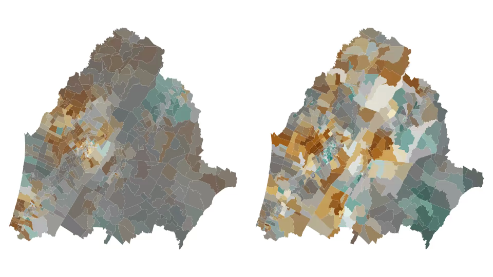
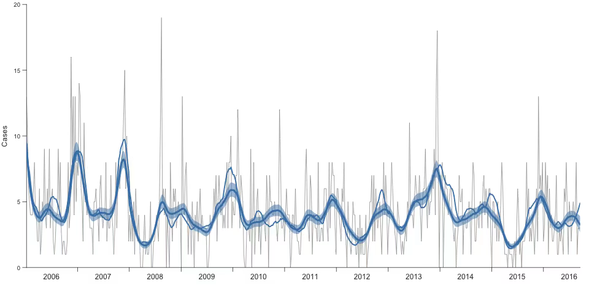

<!-- badges: start -->

<!-- badges: end -->

epiclustR
=========

epiclustR is a spatio-temporal modelling tool for estimating the spatial and temporal risk of disease, and estimating the probability of an anomolous event (a potential 'outbreak') where risk is higher than would be expected given the spatial and temporal trends.

The model of disease is given by

yit = Poisson(&lambda;it)

where

&lambda;it = Rt + Ui + Wit

where Rt is a purely temporal term, Ui is a purely spatial term, and Wit is a spatio-temporal term.

We place Gaussian structural priors on Rt and Ui such that the risk in week t+2 is a linear extrapolation of the risk in weeks t and t+1, and that the risk in region i is the average risk in neighbouring regions.

The model for detecting outbreaks sets

Wit = &beta; Xit

where Xit is an indicator variable, set to 1 if there's an outbreak and 0 if there isn't, that is one with probability pit and &beta; is the (average) size of each outbreak.  The prior on pit allows 1 outbreak per year per region on average.  Priors on pit then allow these outbreaks to be correlated through time (e.g. for a disease where person to person transmission occurs) or uncorrelated through time.  The default implementation is uncorrelated in time.

Data format
-----------

The model requires three data files:
 - A file describing spatial units and regions.
 - A spatial neighbourhood mapping.
 - A file containing cases with week and spatial unit.

Running
-------

Use `load_spatial_neighbours` to read in the spatial neighbours file. All other files can
be read in using `read.csv` or similar.

Run `check_data` to generate the model-specific data structures.

Configure the model with `init_priors` and `init_control`.

Fit the model using `fit_model`.

You can then visualise the fitted model with `plot_model`, `plot_temporal`, `plot_spatial`, and `plot_outbreaks`.

Outbreaks may also be tabulated with `table_outbreaks`.
