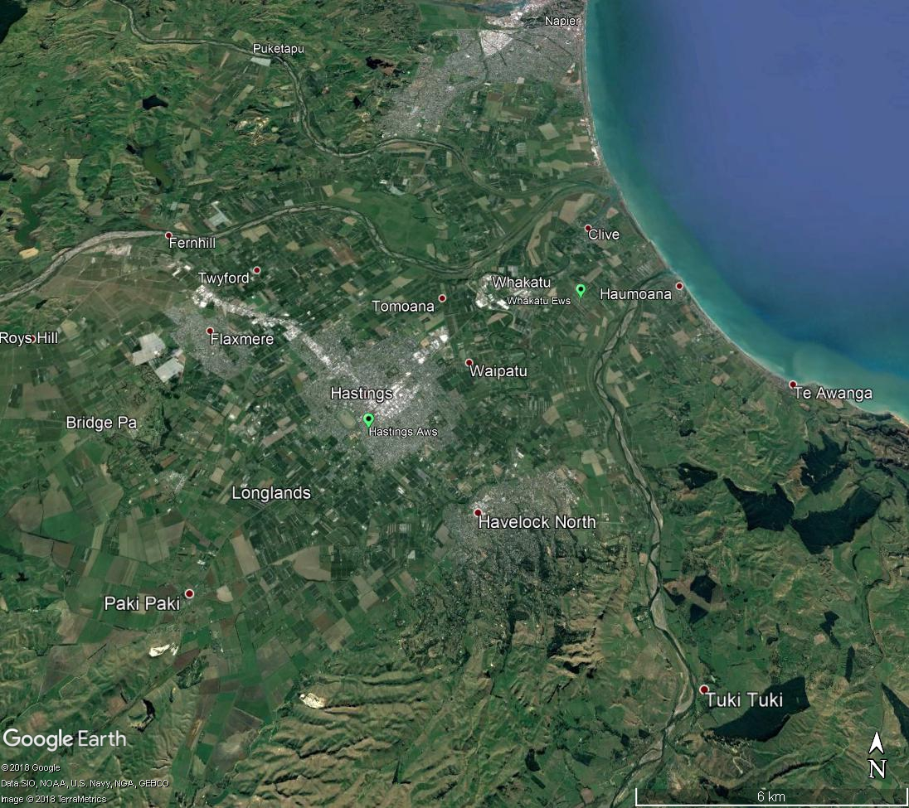

```{r setup, include=FALSE}
knitr::opts_chunk$set(echo = FALSE, dev='tikz', fig.align='center', fig.width=7, message=FALSE, warning=FALSE)
library(epiclustR)
library(dplyr)
library(tidyr)
library(ggplot2)
library(RColorBrewer)
library(maptools)
library(knitr)
library(mgcv)
library(broom)
library(gridExtra)
library(cowplot)
map = readShapeSpatial('../shape_files/hawkes_bay')
load('campy_no_outbreak.Rdata'); hn = new
all_cases = sum(hn$data$cases)
weeks = rownames(hn$data$cases)
```

## Introduction

This report summarizes the analysis undertaken so far for Study 5 of the Havelock North *Campylobacter* Outbreak Study on spatiotemporal modelling of campylobacteriosis notification data from the Hawke's bay from 2009 through August 2016, prior to the large outbreak in Havelock North. In addition, we survey other enterics with potential waterborne spread.

To assess whether there have been outbreaks of campylobacteriosis associated with the Havelock Northwater supply prior to the large outbreak in August 2016, we fit a spatio-temporal model to the data, where we assume that the case rate per population ($\lambda$) can be decomposed on the log scale as
$$
\log(\lambda) = R_t + U_i + W_{it}
$$
into purely temporal ($R_t$) and spatial components ($U_i$), with an additional spatio-temporal component ($W_{it}$).

The temporal and spatial trends $R_t$ and $U_i$ are designed to account for typical changes in disease risk in time (e.g. temporal variation in notification rates across Hawkes Bay, such as more notifications in the summer) and space (e.g. spatial variation in notification rates across Hawkes Bay, such as fewer notifications in areas of higher social deprivation, where people may be less likely to visit a GP following illness). Over and above these trends, the $W_{it}$ term is intended to highlight areas where for a short time period (e.g. one or two weeks) there are more cases than might be otherwise explained by the temporal and spatial trends. It is in this term that we can detect outbreaks, by modelling $W_{it}$ using an outbreak indicator variable that is 1 if there are more cases than we might expect, and 0 if there are not. The outbreak indicator variables are defined per week and per region, where regions are spatially aggregated up from the fine spatial resolution so that wider outbreaks than a single spatial unit can be observed.

The model was run on all campylobacteriosis cases notified between 1 January 1997 and 8 August 2016 in order to exclude the known outbreak cases from August 2016 in Havelock North. Spatial resolution was at the meshblock level, defined by the 2013 meshblock dataset from Statistics New Zealand, and any cases where meshblock accuracy could not be determined were removed. This left `r all_cases` cases over this time period for analysis.

The outbreak regions used were the territorial authority regions, with those meshblocks served by the Havelock North water supply being broken out of the Hastings city region. A plot of the outbreak regions is below.

```{r regions, dev='pdf', fig.width=5, fig.height=5, fig.cap="Outbreak regions for spatiotemporal model correspond to territorial authorities of Wairoa (light green), Hastings district (red), Napier city (pink) and Central Hawke's Bay (green) in addition to Havelock North (blue)."}
map_data = map@data %>% mutate(MB2013 = as.character(MB2013)) %>% left_join(hn$data$spat_list, by=c('MB2013' = 'Spatial'))
pal <- brewer.pal(5, "Set2")
par(mar=c(0,0,0,0))
plot(map, col=pal[map_data$Region], border=NA)
```

## Preliminary results

A plot of the number of cases through time, as well as the temporal trend, with outbreaks highlighted in red is shown below.

```{r temporal, fig.height=4, fig.width=8, fig.cap="Campylobacteriosis notifications in Havelock North. Notifications in grey, fitted temporal trend in black with uncertainty in blue, and potential outbreaks in red."}
# grab the case rate for Havelock North
spat_hn = unlist(hn$dat$rgmb["Havelock North"])
ecases = epiclustR:::ssapply(hn$mod, case_rate_per_time, data = hn$data, smoothed = FALSE, spatial = spat_hn) %>% as.data.frame %>% mutate(Week = weeks) %>% gather(Iteration, ECases, -Week) %>% mutate(ECases = ECases*100000)

scases = epiclustR:::ssapply(hn$mod, case_rate_per_time, data = hn$data, smoothed = TRUE, spatial =spat_hn) %>% as.data.frame %>% mutate(Week = weeks) %>% gather(Iteration, SCases, -Week) %>% mutate(SCases = SCases*100000)

temporal = ecases %>% left_join(scases) %>%
  group_by(Week) %>% summarise(Outbreaks = mean(ECases),
                              LCI = quantile(SCases, 0.025), UCI = quantile(SCases, 0.975),
                              Mean = mean(SCases))

# join up to our actual cases
cases = hn$data$cases %>% as.data.frame %>% tibble::rownames_to_column("Week") %>% gather(Spatial, Cases, -Week) %>%
  left_join(hn$data$spat_list) %>% group_by(Week, Region) %>% summarise(Cases = sum(Cases)) %>%
  filter(Region == "Havelock North")
popn = hn$data$popn %>% as.data.frame %>% tibble::rownames_to_column("Week") %>% gather(Spatial, Population, -Week) %>%
  left_join(hn$data$spat_list) %>% group_by(Week, Region) %>% summarise(Population = sum(Population)) %>%
  filter(Region == "Havelock North")
plot_obj = temporal %>% left_join(cases) %>% left_join(popn) %>% mutate(Week = as.Date(Week))

#plot_obj <- read.csv(file.path(base_dir, "Model output -exc. 2016 outbreak/plot_obj.csv"))
#plot_obj$Week <- as.Date(plot_obj$Week)
p2 <- ggplot(plot_obj %>% filter(Region == "Havelock North"), aes(x=Week, y=Cases / Population * 100000, ymin=LCI, ymax=UCI)) +
  geom_line(col="grey80", size=0.4) +
  geom_ribbon(alpha=0.5, fill="steelblue", col=NA) +
  geom_ribbon(aes(ymin=Mean, ymax=Outbreaks), fill='red', colour='red', size=0.2) +
  geom_line(aes(y=Mean), size=0.6) +
  scale_x_date(labels = date_format("%Y-%m-%d"), date_labels = "%Y", expand = c(0,0), date_breaks = "1 year", limits = as.Date(c('1997-01-10','2016-11-04'))) +
  theme_bw() +
  labs(x = "Year", y = "Modelled\nCase rate") +
  scale_y_continuous(expand = c(0,0))+
  coord_cartesian(ylim = c(0, 120))
p2
```

As can be seen, there is clear evidence of a seasonal trend, with the peak in cases tending to be in the summer months, though in some years this is less pronounced (e.g. 2013), and in others there are multiple peaks (e.g. 2003). The red spikes indicate where the model has detected a larger than expected number of cases in at least one of the regions in a particular week.

The spatial trend is shown on the maps below.

```{r spatial, fig.width = 8, fig.height = 4, dev='pdf', fig.cap="Spatial trend of log relative risk of campylobacteriosis notifications. Green regions have lower risk while brown regions have higher risk."}
par(mfrow=c(1,2), mai=rep(0,4))
plot_spatial(hn$mod, hn$data, period=1, legend=FALSE, threshold=NULL,
             breaks=c(-1.3,-0.5,-0.25,-0.10,-0.05,0.05,0.10,0.25,0.5,1.3),
             shapefile='../shape_files/hawkes_bay.shp', spatField='MB2013')
plot_spatial(hn$mod, hn$data, period=1, legend=TRUE, threshold=NULL,
             breaks=c(-1.3,-0.5,-0.25,-0.10,-0.05,0.05,0.10,0.25,0.5,1.3),
             shapefile='../shape_files/hawkes_bay.shp', spatField='MB2013',
             bbox = matrix(c(1920791,5597710,1942290,5625823), 2))
```

Interestingly, rural areas appear to have lower risk in general than urban areas, with the exception of the Wairoa/Mahia areas, though it should be noted that there are little data in these areas.

The table of potential outbreaks is shown below, where all potential outbreaks with probability at least 20% are shown.

```{r outbreaks, message=FALSE}
table_outbreaks(hn$mod, hn$data) %>% filter(!is.na(CaseID)) %>% kable(row.names=FALSE, caption="Potential outbreaks, the week and location each occur, the outbreak probability and the cases involved.")
```

The case trends and outbreak probabilities for all regions are shown below.

```{r region_table, message=FALSE, fig.width = 6, fig.height = 8, fig.cap="Outbreak probabilities (black) and case numbers (grey) in each region."}
par(mfrow=c(5,1), mar = c(3,3,2,2))
plot_region(hn$mod, hn$data, region = "Havelock North")
plot_region(hn$mod, hn$data, region = "Napier City")
plot_region(hn$mod, hn$data, region = "Hastings District")
plot_region(hn$mod, hn$data, region = "Central Hawke's Bay District")
plot_region(hn$mod, hn$data, region = "Wairoa District")
```

## Potential outbreaks versus rainfall and water quality

In this section we focus on the potential outbreaks as determined by the spatio-temporal model in Havelock North, and compare them to known outbreaks, rainfall, soil deficit and runoff, and detection of *E. coli* in the Havelock North water supply as an indicator of faecal contamination.

Water supply data from the Winz database from 2003 through 2016 was provided by Hastings District council and filtered for all findings from the Havelock North supply.

Rainfall data, including soil deficit and runoff was obtained from the CliFlo climate database from the Whakatu (1998-2016) and Hastings (2005-2016) sites (see below), the nearest sites with rainfall data available. For the period where both sites exist, the data were averaged.

```{r, out.width='5in', fig.cap="Location of Whakatu and Hastings weather climate stations"}

```

The figure below summarises these findings.

```{r, fig.height=6, fig.width=8, fig.cap="Modelled case rate per 100,000 population (top: cases in grey, model fit in black, uncertainty in blue, potential outbreaks in red), Rainfall (middle) and presence of high \\emph{E. coli} readings (bottom)."}
other_enterics.df <- read.csv("Other_enterics_casebypopulationTA.csv")
start.date <- as.Date("10/01/1997", "%d/%m/%Y")
#Subset by campy/havelock
campy.havelock.df <- other_enterics.df %>%
  ungroup() %>%
  filter(Disease == "Campylobacteriosis", TA2013 == "Havelock North") %>%
  mutate(ReportWeek = as.Date(ReportWeek), Outbreak = ifelse(Outbreak.count.total >= 1, 1, 0), Days = as.numeric(ReportWeek-start.date)) %>%
  filter(ReportWeek <= '2016-07-31')
#Gam, knots = 100
havelock.gam <- gam(Total_Cases ~ s(Days, k = 100), offset = log(Total_Population),
                    family = quasipoisson, data = campy.havelock.df)
havelock.gam.aug <- augment(havelock.gam)
#Calculate CI
havelock.disease.output <-campy.havelock.df %>%
  bind_cols(havelock.gam.aug) %>%
  mutate(lwr = .se.fit*(-1.96), upr = .se.fit*1.96, fit.case = 100000*(exp(.fitted)), CI.up = 100000*(exp(.fitted + upr)),
         CI.lw = 100000*(exp(.fitted + lwr)))
#Plot
p1 <- ggplot(havelock.disease.output, aes(ReportWeek, case_by_population)) +
  scale_x_date(labels = date_format("%Y-%m-%d"), date_labels = "%Y", expand = c(0,0), date_breaks = "1 year",
               limits = as.Date(c('1997-01-10','2016-11-04'))) +
  labs(x = "Year", y = "Cases/100,000\nPopulation") +
  geom_vline(data=filter(havelock.disease.output, Outbreak.count.total > 0), aes(xintercept = ReportWeek), colour="#ff9a9a", size = 2) +  #prev #ffb3b3
  geom_line(data = havelock.disease.output, aes(ReportWeek, case_by_population), colour = "grey80", size = 0.4) +
  geom_ribbon(aes(ymin = CI.lw, ymax = CI.up), fill = "steelblue", alpha = 0.5) +
  geom_line(data = havelock.disease.output, aes(ReportWeek, fit.case), size = 0.8) +
  coord_cartesian(ylim = c(0, 120), expand = FALSE) +
  theme_bw()

weather.df <- read.csv("weather.average.csv")
weather.df$ReportWeek <- as.Date(weather.df$ReportWeek)
#Choose colours
cols <- c("amount" = "grey65", "deficit" = "#9dc2ff", "runoff" = "red")
#Plot
p3 <- ggplot(weather.df, aes(ReportWeek)) +
  geom_ribbon(aes_string(ymin = 0, ymax = "ave.week.sum", fill = "variable"), alpha = 1) +
  coord_cartesian(ylim=c(-15, max(weather.df$ave.week.sum, na.rm = T))) +
  scale_fill_manual(values = cols) +
  scale_x_date(labels = date_format("%Y-%m-%d"), date_labels = "%Y", expand = c(0,0), date_breaks = "1 year",
               limits = as.Date(c('1997-01-10','2016-11-04'))) +
  labs(x = "Year", y = "Rainfall (mm)") +
  theme_bw() +
  theme(legend.direction = "horizontal", legend.position = c(0.85, 0.9), legend.background = element_rect(fill=alpha('blue', 0)),
        legend.text=element_text(size=rel(0.7))) +
 guides(fill = guide_legend(title = NULL, keywidth = 0.7, keyheight = 0.5))

water.plot <- read.csv("water_plot.csv")
water.plot$ReportWeek <- as.Date(water.plot$ReportWeek)

p4 <- ggplot() +
  scale_x_date(labels = date_format("%Y-%m-%d"), date_labels = "%Y", expand = c(0,0), date_breaks = "1 year",
               limits = as.Date(c('1997-01-10','2016-11-04'))) +
  scale_y_continuous(name="High E. coli\nReading", breaks=NULL, limits=c(0,1), expand=c(0,0)) +
#  geom_vline(data=water.plot, mapping=aes(xintercept=ReportWeek), color="#ff9a9a", size = 2)+
  geom_rect(data=water.plot, mapping=aes(xmin=ReportWeek, ymin=0, xmax=ReportWeek+7, ymax=1), fill="red", col=NA)+
  labs(x = "Year") +
    theme_bw()

p2 <- p2 + theme(axis.title.x = element_blank(), axis.text.x = element_blank())
p3 <- p3 + theme(axis.title.x = element_blank(), axis.text.x = element_blank())

# Now plots are aligned vertically with the legend to the right
ggdraw(plot_grid(plot_grid(p2, p3, p4, ncol=1, align='v')))
```

As can be seen, in general there is not a particularly strong correlation between disease outbreaks and heavy rainfall events, or runoff, other than when these events occur in the winter (e.g. in 2009). There is little correlation between high *E. coli* readings in the water supply and outbreaks of campylobacteriosis.

## Other enterics by region

To explore the potential of other, non-*Campylobacter* outbreaks being associated with the Havelock North water supply, we consider the time series of cases of giardiasis, cryptosporidiosis, leptospirosis, salmonellosis and shiga-toxin producing *E. coli* (VTEC/STEC).

We first consider these per region to assess for differences in the timeseries between spatial locations. In the below plots, the red bands are where cases in that week and region are flagged as belonging to an outbreak in Episurv, and the black curve with blue uncertainty band corresponds to average trend through time.

### Giardiasis

With giardiasis, there is some evidence that case trends differ between region, and some evidence of undetected outbreaks, e.g. around January 2010 in Havelock North and early 1999 nd 2002 in Hastings.

```{r Enterics, fig.width=7, fig.height=8, fig.cap="Giardiasis notifications by region. Notifications in grey, trend in black, uncertainty in blue and recognised outbreaks in red"}
source('gam_disease_plots.R')
plot_gam_disease(other_enterics.df, "Giardiasis", 20, 20, 20, 20, 20, 35)
```

### Campylobacteriosis

The campylobacteriosis case trends shows clearly that there were no outbreaks in the Episurv database for Havelock north prior to the August 2016 outbreak. This is in contrast to what the spatiotemporal model employed here has identified. Similarly, there is a clear cluster of cases in Hastings (1999-2000) that went undetected.

```{r Enteric4, fig.width=7, fig.height=8, fig.cap="Campylobacteriosis notifications by region. Notifications in grey, trend in black, uncertainty in blue and recognised outbreaks in red"}
plot_gam_disease(other_enterics.df, "Campylobacteriosis", 100, 100, 100, 100, 100, 150)
```

### Cryptosporidiosis

Looking at the cryptosporidiosis data shows again that there is the potential for undetected outbreaks, such as in Havelock North in 2001 (possibly related to detected outbreaks in Hastings and Napier City) and in Wairoa in 2002/2003.

```{r Enteric1, fig.width=7, fig.height=8, fig.cap="Cryptosporidiosis notifications by region. Notifications in grey, trend in black, uncertainty in blue and recognised outbreaks in red"}
plot_gam_disease(other_enterics.df, "Cryptosporidiosis", 20, 20, 20, 20, 20, 55, smooth = FALSE)
```

### Leptospirosis

There are little data for leptospirosis, though what is interesting is the higher case rates in Wairoa, though these represent mostly single cases, there is a peak of 3 cases in a single week during 2002.

```{r Enteric2, fig.width=7, fig.height=8, fig.cap="Leptospirosis notifications by region. Notifications in grey, trend in black, uncertainty in blue and recognised outbreaks in red"}
plot_gam_disease(other_enterics.df, "Leptospirosis", 10, 10, 10, 10, 10, 40, smooth = FALSE)
```

### Salmonellosis

The trend for salmonellosis shows a common increase in rate around 2002, dropping of by 2006-2007. Again there is evidence for potential undetected outbreaks such as in Napier in 2000.

```{r Enteric3, fig.width=7, fig.height=8, fig.cap="Salmonellosis notifications by region. Notifications in grey, trend in black, uncertainty in blue and recognised outbreaks in red"}
plot_gam_disease(other_enterics.df, "Salmonellosis", 15, 15, 15, 20, 15, 30)
```

### VTEC/STEC infection

There are too little data for VTEC/STEC infection to estimate trends, and cases are generally limited to at most one per week.

```{r, fig.width=7, fig.height=8, fig.cap="VTEC/STEC infection notifications by region. Notifications in grey, trend in black, uncertainty in blue and recognised outbreaks in red"}
plot_gam_disease(other_enterics.df, "VTEC/STEC infection", 2, 3, 3, 3, 1, 15, smooth = FALSE)
```

## Regions by enterics

We next compare the case rates of each enteric by region. These plots demonstrate clearly that campylobacteriosis notification rates are an order of magnitude higher than other enterics.

```{r regions1, fig.width=7, fig.height=8, fig.cap="Enteric disease notifications in Central Hawke's Bay. Notifications in grey, trend in black, uncertainty in blue and recognised outbreaks in red"}
plot_gam_region(other_enterics.df, "Central Hawke's Bay District", 25, 10, 15, 10, 10, 3, 40)
```

```{r regions2, fig.width=7, fig.height=8, fig.cap="Enteric disease notifications in Hastings district. Notifications in grey, trend in black, uncertainty in blue and recognised outbreaks in red"}
plot_gam_region(other_enterics.df, "Hastings District", 25, 10, 15, 10, 10, 3, 40)
```

```{r regions3, fig.width=7, fig.height=8, fig.cap="Enteric disease notifications in Havelock North. Notifications in grey, trend in black, uncertainty in blue and recognised outbreaks in red"}
plot_gam_region(other_enterics.df, "Havelock North", 8, 6, 15, 10, 10, 3, 80)
```

```{r regions4, fig.width=7, fig.height=8, fig.cap="Enteric disease notifications in Napier city. Notifications in grey, trend in black, uncertainty in blue and recognised outbreaks in red"}
plot_gam_region(other_enterics.df, "Napier City", 25, 10, 15, 10, 10, 3, 40)
```

```{r regions5, fig.width=7, fig.height=8, fig.cap="Enteric disease notifications in Wairoa. Notifications in grey, trend in black, uncertainty in blue and recognised outbreaks in red"}
plot_gam_region(other_enterics.df, "Wairoa District", 25, 10, 15, 10, 10, 3, 40)
```

## Summary

In summary, there appears to be several potential outbreaks of campylobacteriosis in all regions of Hawkes bay, and considering its size, a significant number of these are in Havelock North.

There is little correlation, however, between these potential outbreaks and periods of heavy rainfall or water runoff, or with high *E. coli* readings in the water supply.

A comparison of other enteric diseases shows a clear trend that there are potential outbreaks that are not reported, demonstrated by clusters of increased case rates for short periods in individual regions.

We are currently running the spatio-temporal outbreak model on cryptospiridiosis, giardiasis and salmonellosis data to assess whether such outbreaks can be detected.

